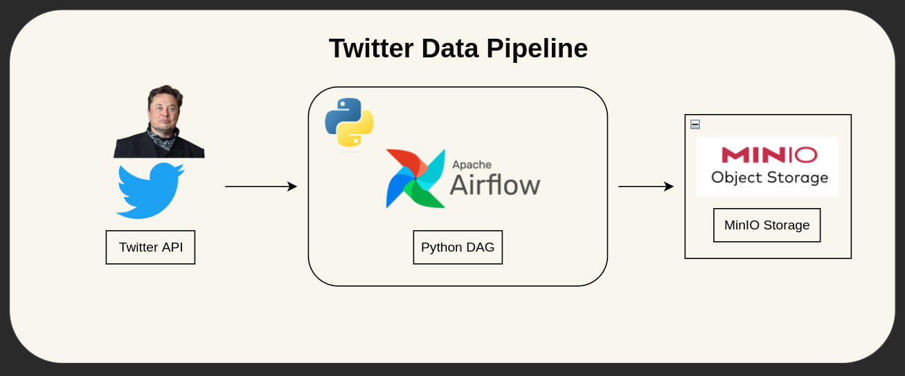

# Twitter Data Pipeline with apache-airflow & MinIO

## Table of Contents

- [About](#about)
- [Getting Started](#getting_started)
- [Usage](#usage)
- [Resources](#resources)
- [etc.](#licence)

## About <a name = "about"></a>

A simple example of Data Pipeline using apache-airflow (Orchestrator) and MinIO(Object Storage like s3).

## Getting Started <a name = "getting_started"></a>

Below is a design of the project. (The drawio file can be found in `docs/architecture.drawio`:


## Prerequisites

- [docker-compose](https://docs.docker.com/compose/)
- [How to generate Twitter API Token](https://developer.twitter.com/en/docs/authentication/oauth-2-0/bearer-tokens)


## Usage <a name = "usage"></a>
1. We need to create and `.env` from [sample.env](./sample.env):
```bash
cp sample.env .env
```
2. Add the Twitter Bearer Token in the `.env` file as below:
```bash
TWITTER_BEARER_TOKEN="vNVxBVjj-0yhF!Ipc-p7Nrzl7C2wISOI6BLXVk087/jJS4auIp0SKSXI/7npGy1kl7xDXxRuJ55Lor5FHI!6!!a5v0!IrxCDYQDEgMBQzOZivgIEpQJsvC4A0nqFbqxA"
```

3. We can simply run the pipeline using `docker-compose`.

To start
```bash
docker compose up -d
```

To shutdown
```bash
docker compose down
```

4. Then we can connect the below respectively:
- Apache-Airflow: http://localhost:8080
- MinIO Console: http://localhost:9090

## Resources <a name = "resources"></a>
- [How to generate Twitter API Token](https://developer.twitter.com/en/docs/authentication/oauth-2-0/bearer-tokens)
- [apache-airflow](https://airflow.apache.org)
- [MinIO](https://min.io)
- [docker-compose](https://docs.docker.com/compose/)

## License

This project is licensed under the MIT License - see the [LICENSE](LICENSE) file for details.

## Credits

See as you fit.

## Contact

If you have any questions or would like to get in touch, you can email: <mike.kenneth47@gmail.com>  OR [twitter](https://twitter.com/mikekenneth77)
